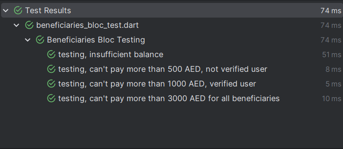

# balance_project

A new Flutter project.

## Getting Started

This project is a starting point for a Flutter application.

## instrucytions on how to run unit tests
1. navigate to test folder
2. open the file 'beneficiaries_bloc_test.dart'
3. right click on the file and select 'Run tests in beneficiaries_bloc_test.dart'

## Image of the test results

